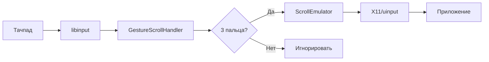

# Touch Control + Gesture Scroll

Интегрированная система плавной прокрутки для Linux с поддержкой жестов тачпада.

## Описание

Этот проект объединяет две технологии:
- **touch-control** - эмулятор скролла для Wayland/X11
- **touchegg** (libinput) - захват жестов тачпада

В результате получается система, которая позволяет использовать **3-пальцевые swipe жесты** для **плавной прокрутки** в любых приложениях.

## Особенности

### 🎯 Основные возможности
- ✅ Плавная прокрутка 3 пальцами на тачпаде
- ✅ Работает в Wayland и X11
- ✅ Вертикальная и горизонтальная прокрутка
- ✅ Настраиваемая скорость и плавность
- ✅ Консольные инструменты для ручной прокрутки

### 🔧 Преимущества перед существующими решениями
- **Непрерывная прокрутка**: в отличие от touchegg, который выполняет действие один раз, здесь прокрутка происходит плавно во время движения пальцев
- **Без sudo**: работает без прав root (при правильной настройке)
- **Универсальность**: поддерживает и X11, и Wayland
- **Гибкость**: множество настроек скорости, плавности и поведения

## Быстрый старт

### 1. Установка зависимостей

Ubuntu/Debian:
```bash
sudo apt update
sudo apt install build-essential libinput-dev pkg-config
```

### 2. Сборка
```bash
cd touch-control
make all
```

### 3. Проверка системы
```bash
./gesture-scroll --test
```

### 4. Запуск
```bash
./gesture-scroll -v
```

Теперь используйте 3 пальца на тачпаде для прокрутки!

## Состав проекта

### Программы

1. **`scroll-tool`** - консольный инструмент для ручной прокрутки
   ```bash
   ./scroll-tool down 5           # Скролл вниз на 5 шагов  
   ./scroll-tool smooth-up 10     # Плавный скролл вверх
   ```

2. **`gesture-scroll`** - демон для обработки жестов тачпада
   ```bash
   ./gesture-scroll               # Запуск с настройками по умолчанию
   ./gesture-scroll -v            # С подробным выводом
   ./gesture-scroll --daemon      # В фоновом режиме
   ```

### Библиотеки

- **`libscrollemulator.so`** - библиотека для интеграции в другие проекты
- **`scroll_emulator.h`** - C/C++ заголовочный файл
- **`gesture_scroll_handler.h`** - заголовочный файл для обработки жестов

## Жесты

| Жест | Действие |
|------|----------|
| 3 пальца вверх | Плавная прокрутка вверх |
| 3 пальца вниз | Плавная прокрутка вниз |
| 3 пальца влево | Горизонтальная прокрутка влево |
| 3 пальца вправо | Горизонтальная прокрутка вправо |

## Настройка

### Параметры gesture-scroll

```bash
./gesture-scroll [ОПЦИИ]

Опции:
  -d, --delay DELAY      Задержка между шагами скролла (мс)
  -s, --smooth STEPS     Количество промежуточных шагов для плавности  
  -a, --accel FACTOR     Ускорение (1.0 = постоянная скорость)
  -v, --verbose          Подробный вывод
  --daemon               Запуск в фоновом режиме
  --test                 Тест системы
```

### Примеры настройки

```bash
# Медленная и очень плавная прокрутка
./gesture-scroll -d 30 -s 5

# Быстрая прокрутка с ускорением
./gesture-scroll -d 20 -a 1.5

# Запуск в фоне
./gesture-scroll --daemon -q
```

## Установка в систему

### Автоматическая установка
```bash
make install
```

Это установит:
- `scroll-tool` → `/usr/local/bin/`
- `gesture-scroll` → `/usr/local/bin/`
- Библиотеки → `/usr/local/lib/`
- Заголовочные файлы → `/usr/local/include/`

### Настройка прав доступа

Для работы без sudo добавьте пользователя в группу input:
```bash
sudo usermod -a -G input $USER
```
Затем перелогиньтесь.

### Автозапуск

Создайте systemd службу:
```bash
# Создаем файл службы
sudo tee /etc/systemd/user/gesture-scroll.service << EOF
[Unit]
Description=Gesture Scroll Daemon
After=graphical-session.target

[Service]
Type=simple
ExecStart=/usr/local/bin/gesture-scroll --daemon -q
Restart=always
RestartSec=5

[Install]
WantedBy=default.target
EOF

# Включаем автозапуск
systemctl --user enable gesture-scroll.service
systemctl --user start gesture-scroll.service
```

## Тестирование

### Проверка системы
```bash
make test-gesture          # Быстрый тест
./gesture-scroll --test    # Подробная диагностика
```

### Живое тестирование  
```bash
make test-gesture-live     # Запуск с выводом отладки
```

### Тестирование консольных команд
```bash
make test-scroll           # Тест scroll-tool
./scroll-tool test         # Демонстрация всех функций
```

## Архитектура

### Компоненты
1. **ScrollEmulator** (из touch-control)
   - Эмуляция скролла через X11/uinput
   - Поддержка плавных скроллов
   - Автоматический выбор метода

2. **GestureScrollHandler** (новый)
   - Захват libinput событий
   - Обработка 3-пальцевых жестов
   - Интеграция с ScrollEmulator

3. **libinput integration** (из touchegg)
   - Низкоуровневый захват жестов
   - Поддержка всех устройств ввода

### Принцип работы



## Устранение проблем

### Gesture-scroll не запускается
```bash
# Проверьте права доступа
groups | grep input

# Проверьте libinput
pkg-config --exists libinput && echo "OK" || echo "Не найден"

# Попробуйте с sudo
sudo ./gesture-scroll --test
```

### Жесты не работают
```bash
# Проверьте что тачпад поддерживает жесты
libinput list-devices

# Запустите с отладкой
./gesture-scroll -v
```

### Прокрутка не работает
```bash
# Проверьте ScrollEmulator
./scroll-tool test

# Проверьте графическое окружение  
echo $XDG_SESSION_TYPE
echo $WAYLAND_DISPLAY
echo $DISPLAY
```

## Разработка

### Сборка из исходников
```bash
git clone <repository>
cd touch-control
make all
```

### Добавление новых жестов
Редактируйте `gesture_scroll_handler.cpp`:
```cpp
// В handleSwipeBegin измените условие:
if (gesture_state_.finger_count == 4) {  // Для 4 пальцев
    // ваш код
}
```

### Интеграция в другие проекты
```cpp
#include "scroll_emulator.h"

ScrollEmulator emulator;
emulator.initialize();
emulator.smoothScrollDown(10, 1000);  // Плавно вниз
```

## Совместимость

### Протестировано на:
- ✅ Ubuntu 20.04+ (Wayland/X11)
- ✅ Fedora 35+ (Wayland/X11)  
- ✅ Arch Linux (Wayland/X11)
- ✅ Pop!_OS 22.04+

### Требования:
- Linux kernel 4.15+
- libinput 1.10+
- Тачпад с поддержкой мультитач
- X11 или Wayland

## Лицензия

Проект основан на:
- **touchegg** - GNU GPL v3
- **touch-control** - собственная разработка

## Поддержка

- 🐛 Баги: создайте issue
- 💡 Предложения: создайте feature request  
- 📧 Email: [ваш email]
- 💬 Обсуждения: [ссылка на форум/чат] 